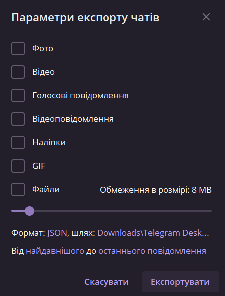
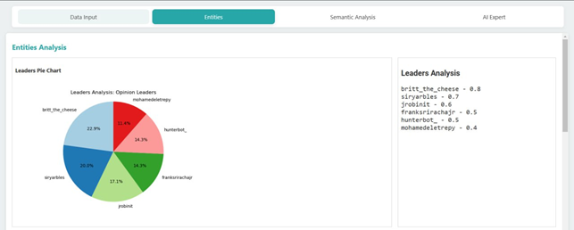

# Search Community Connections (SCConnector)

## Назва команди: **Genova**

## Проєкт розроблений у рамках:
Другого міжнародного OSINT Automation & Warcrimes Hackathon


## Обране завдання Хакатону:
### Аналіз мережевих спільнот
Дослідження структури конкретної спільноти в соціальних мережах або форумах, ідентифікація лідерів думок та розкриття зв’язків між учасниками спільноти.

---

## Опис проєкту та його мета
**SCConnector** – це інструмент для автоматизованого дослідження структур спільнот в соціальних мережах або форумах.

**Мета проєкту** – створити інструмент, який дозволить ефективно, швидко та точно обробляти дані з соціальних мереж, месенджерів і форумів, надаючи OSINT-аналітикам потужні засоби для дослідження спільнот і отримання в зручному форматі аналітичної інформації.

## Системні вимоги:
- **Операційна система**: Windows, macOS, Linux
- **Python**: Версія 3.x
- **Залежності**:
  - Flask
  - logging
  - g4f
  - requests
  - json
  - matplotlib
  - [Додаткові бібліотеки вказані у `requirements.txt`]

*Програмний код розробленого проекту писався із дотриманням стандартів PEP8. Всі модулі та функції містять докстрінги. В коді наявні коментарі, що описують виконуваний код.

---

## Інструкція з налаштування середовища

### Встановлення залежностей

Перед тим як встановлювати залежності, необхідно переконатися, що Python 3.x встановлений у вашій системі.

### Перевірка встановлення Python
1. Відкрийте термінал (або командний рядок у Windows).
2. Виконайте команду:
	```bash
	python --version
3. Якщо Python встановлений, ви побачите його версію, наприклад:
	```bash
	Python 3.9.7
Якщо Python не встановлений, виконайте інструкції нижче для встановлення Python.

---
### Встановлення Python на Windows

1.  Завантажте останню версію Python з офіційного сайту [python.org](https://www.python.org/).
2.  Запустіть завантажений інсталятор.
3.  У вікні встановлення:
    -   Оберіть "Add Python to PATH" (це важливо для коректної роботи).
    -   Натисніть "Install Now".
4.  Після встановлення знову виконайте команду для перевірки:
	```bash
	python --version 
---
### Встановлення Python на Linux
1.  Відкрийте термінал.
2.  Виконайте одну з команд залежно від вашого дистрибутива:
    -   **Ubuntu/Debian**:
        ```bash
        sudo apt update
        sudo apt install python3 python3-pip`
    -   **Fedora**:
        ```bash
        sudo dnf install python3 python3-pip
    -   **Arch Linux**:
        ```bash
        sudo pacman -S python python-pip
3.  Перевірте встановлення, виконавши команду:
	```bash
	python3 --version
---
### Встановлення залежностей (продовження)
1. Переконайтеся, що ви знаходитесь у директорії проєкту.
2. Виконайте команду для встановлення всіх необхідних бібліотек:

   ```bash
   pip install -r requirements.txt
3. **Примітка:** Якщо команда `pip` не працює, використовуйте `python -m pip`:
   ```bash
   pip python -m pip install -r requirements.txt
### Тепер середовище для роботи з проєктом готове!

## Покроковий гайд запуску програми

### Клонування репозиторію
1. Відкрийте термінал та виконайте команду:
	```bash
    git clone https://github.com/<your-repo>/SCConnector.git
2. Перейдіть у директорію проєкту:
	```bash
	cd SCConnector
### Приклад запуску:
1. Відкрийте командний рядок та перейдіть до папки проєкту.
2. Виконайте команду:
	```bash
	python server.py
3. Відкрийте веб-браузер та перейдіть за адресою:
   ```arduino
   http://localhost:5000


## Приклад використання програми

*Перед використанням програми ознайомтеся з пунктами нижче. Це дасть розуміння звідки брати інформацію, яку потрібно надавати для роботи програми. 

---
### Як отримати свій токен у Discord

Токеном Discord називається унікальний код автентифікації користувача, який присвоюється індивідуально всім учасникам месенджера. Він відображається через консоль розробника, тому для отримання токена обов'язково потрібно бути авторизованим у своєму обліковому записі та використовувати клієнт на ПК або веб-версію Дискорда.

**Навіщо потрібний токен і чи можна його передавати іншим користувачам**

Давайте відразу почнемо з того, що ключ автентифікації – конфіденційна інформація кожного користувача, яку небажано надсилати третім особам. Зловмисники можуть використовувати токени інших користувачів, щоб авторизуватися в підозрілих роботах, відправляти повідомлення або навіть отримувати повідомлення поза клієнтом, коли навіть вхід до облікового запису не потрібно.

Якщо говорити про застосування токена власником облікового запису, то в більшості випадків він потрібен розробникам роботів і тим, хто хоче інтегрувати API Дискорда в інше програмне забезпечення. Для підключення свого облікового запису достатньо вставити в код ключ аутентифікації, щоб виконувати основні дії в месенджері без звернення до клієнта.

**Отримання власного токена в Discord**

Якщо ви використовуєте мобільний додаток Discord, отримати токен не зможете, оскільки для цього викликається консоль розробника. Тому потрібно буде виконати авторизацію в клієнті на ПК або у веб-версії, відкритій через браузер. Далі знадобиться реалізувати кілька простих кроків:

1.  У браузері перебуваючи на веб-версії Discord натисніть клавішу **F12** , щоб викликати інструменти розробника. Якщо йдеться про клієнта Discord, то комбінація набуває вигляду **Ctrl+Shift+I**

2. Повинно відкрити вікно, яке виділено на наступному скріншоті. Якщо чомусь у програмі воно не відкривається, перейдіть до веб-версії месенджера.

3. У цьому вікні перейдіть на вкладку **Network** .

4. Використовуйте пошук із фільтром, ввівши там **_/api_** . Для відображення всіх відомостей, які підходять під запит, запис дій у мережі необхідно оновити, для чого використовуйте клавіші **Ctrl + R** .

5. Дочекайтеся відображення імен, серед яких знайдіть **«Science»** . Таких елементів може бути кілька, тому іноді доведеться перевірити кожен, щоб зрозуміти, в якому з них знаходиться токен.

6. Вибравши один із елементів із зазначеною назвою, всередині нього відкрийте вкладку **Headers** .

7. Натискайте список параметрів, поки не знайдете назву **«Authorization‎»** . Після двох точок відображається ваш індивідуальний токен, який тепер можна скопіювати та використовувати у своїх цілях. Ще раз нагадаю, що передавати його до рук третіх користувачів категорично заборонено.

Всі інші дії, пов'язані із застосуванням отриманого токена, залежать від цілей, для яких дана інформація була скопійована.
---
### Де знайти ID сервера/повідомлення?
Користувачі, окремі повідомлення та цілі сервери Discord мають цифровий ідентифікатор (ID), який може знадобитися у різних випадках. Хоча ви можете користуватися Discord, не знаючи жодного з цих ідентифікаційних номерів, якщо ви звертаєтеся до нашої служби підтримки , вони можуть вимагати ідентифікатор, щоб допомогти вам. Ось як отримати ці ідентифікатори як клієнтської версії для комп'ютера, так і на мобільному пристрої.

**Як увімкнути режим розробника**

Щоб мати можливість копіювати ідентифікатор, необхідно, щоб увімкнено **режим розробника** . І як це зробити.

**У додатку для ПК**

1. Натисніть  **"6"** у лівому нижньому кутку настільної програми, щоб відкрити **Установки користувача** .

2. Потім перейдіть до розділу **"Розширені"** .

3. Тепер натисніть перемикач поруч із **"Режим розробника"** , щоб увімкнути його. "Галочка" означає, що він увімкнений, а символ "x" - що він вимкнений.


**Як знайти ID сервера**

**У додатку для ПК**

1. Перейдіть до сервера, з якого потрібно скопіювати ID.

2. Клацніть правою кнопкою миші на піктограмі сервера та натисніть **Копіювати ID сервера** .

3. Тепер ви можете вставити цей ідентифікаційний номер сервера, куди вам необхідно.

---
### Інструкція для завaтаження дампу чату з месенджера Telegram
 
1. Обираємо чат (спільноту), та входимо у неї:
 
2. Далі зверху зліва натискаємо на три вертикальні крапки:

3. Після натискання з’являється випадаючий список з наташтуваннями. Далі обираємо налаштування “Експортувати історію чату”:
 
 4. Після натискання треба вибрати налаштування під завантаження деяких типів даних з чату, обмежений розмір завантажуваних файлів, формат файлів, шлях для збереження файлів, дати з початкової по кінцеву дати:
 
 5. Натискаємо на “HTML” для вибору формата збереження:

6. Далі обираємо та натискаємо “Зберегти” для підтверження вибору:  

7. Також можна натиснути на “найдавнішого”, “останнього повідомлення” для визначення проміжку часу за який треба експортувати дані чату:

8. Далі можна обрати шлях для завантаження дампу, натиснувши на шлях:


9. Коли обране все необхідне, можна натискати “Еспортувати” для завантаження дампу:

Таким чином виглядає процес вивантаження даних:

10. Після завершення з’явиться кнопка “Переглянути”, натискаємо на неї для перегляду файлів:

Таким чином виглядає папка з вивантаженими файлами:


---

# Інструкція з використання SCСonnector (розробленого продукту)

На головній сторінці, першим кроком необхідно обрати в якому застосунку буде проводитись аналіз мережевих спільнот. Обрати необхідно з випадаючого поля, а саме Telegram або Discord (рис.1).

 
Рис. 1 – Випадаючий список

У випадку якщо було обрано Telegram необхідно завантажити на сервіс підготовлений дамп, який було вивантажено завчасно. Файл формату JSON. В поле Upload при натисканні відкривається файловий провідник, який дає змогу обрати необхідний файл (рис.2). Наступний крок натискаємо кнопку Running. Починається обробка завантаженого файлу. На виході ми отримуємо можливість завантажити спарсерений файл та візуально наглядний перегляд завантаженої бесіди (рис.3).


Рис. 2 – Поле завантаження файлу
 
Рис. 3 – Оброблений файл
 
При обранні Discord у випадаючому вікні для завантаження інформації необхідно заповнити поля (рис. 4). Перше поле «Enter your token» вводимо ваш персональний токен для авторизації. Наступне поле «Enter the channel ID» необхідно ввести id спільноти яку будемо аналізувати. Поле «Enter the channel name»  заповнюємо назвою каналу та обираємо дату з якої брати інформацію. Після натискання на кнопку Running відбувається обробка даних та надає можливості такі ж самі як і при роботі з Telegram.


Рис. 4 – Заповнення полів для Discord

Всі описані вище дії відбувалися у вкладці Data Input. Наступна вкладка Entities візуалізує оброблену інформацію (рис. 5). Перший блок Leaders Pie Chart візуалізує кругову діаграму лідерів думок завантаженого файлу чату. Наступний блок Leaders Analysis Визначає топ лідерів спільноти та оцінює їх від 0 до 1. Наступна частина під назвою User Activity Plot малює графік активності користувачів в залежності від часу та кількості повідомлень (рис. 6). Далі блок Chat Topics Percentage виводить теми обговорень та їх відсоткове відношення. Наступний блок Community Activity Plot візуалізує графічно пікові активності повідомлень в день (рис. 7). І останній блок User Message Count підраховує кількість повідомлень користувачів.


Рис. 5 – Перший блок виводу інформації

Рис. 6 – Другий блок виводу інформації

Рис. 7 – Третій блок виводу інформації

У вкладці Semantic Analysis будується мережа зв’язаних користувачів у вигляді графу. За допомогою семантичної мережі досліджується можливі зв’язки між персонами (рис. 8).

Рис. – 8 Семантична модель

Остання вкладка AI Expert дає можливість задати промт до віртуального експерта для детального аналізу завантажених файлів (рис. 9). Велика мовна модель GPT–4.


---

